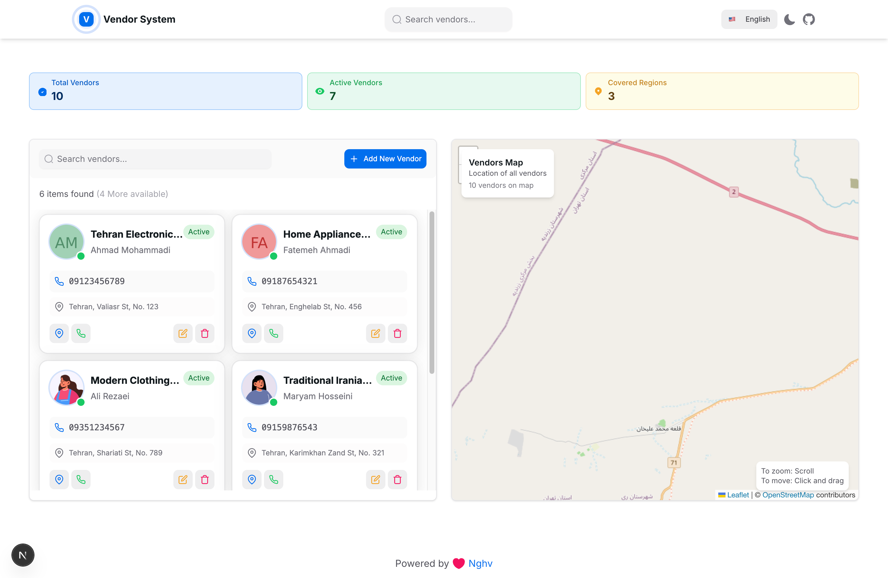
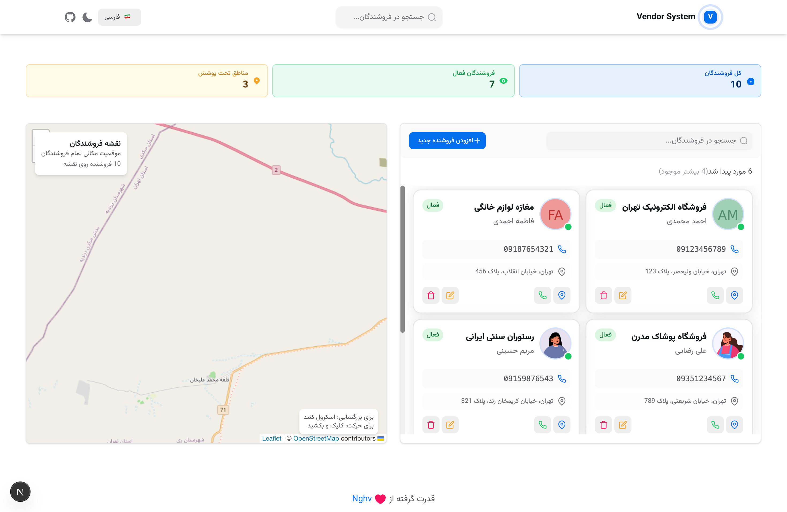
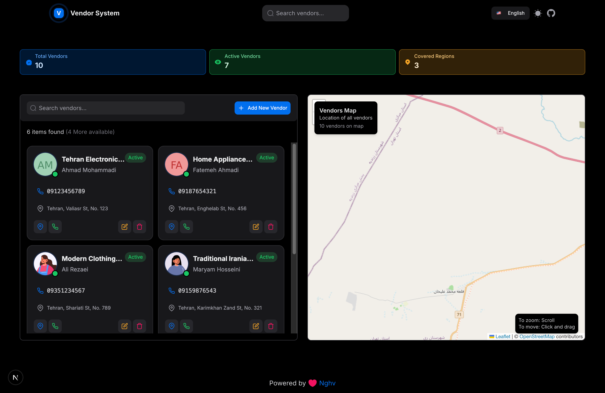
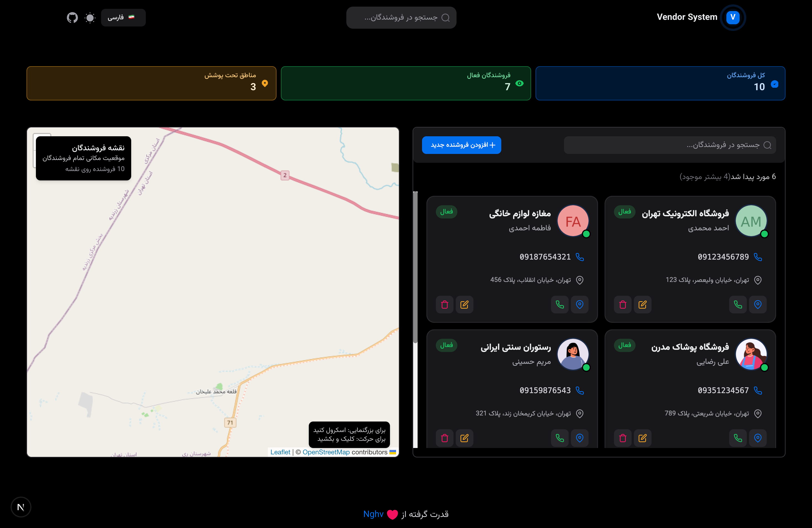

# 🏪 Vendor Management System

A modern, responsive vendor management application built with Next.js 15, React 19, and HeroUI. This application provides a comprehensive solution for managing vendors with interactive maps, real-time search, and multilingual support.

## 📸 Screenshots

### Light Theme
<div align="center">
  
  
</div>

### Dark Theme
<div align="center">
  
  
</div>

## ✨ Features

### 🗺️ Interactive Map Integration
- **Real-time Map Display**: Interactive Leaflet maps with vendor locations
- **Smart Popups**: Click on vendor cards to automatically show map popups
- **Location-based Search**: Find vendors by geographical proximity
- **Responsive Map Controls**: Optimized for both desktop and mobile devices

### 🔍 Advanced Search & Filtering
- **Real-time Search**: Instant vendor search with debounced input
- **Multi-language Support**: Search in Persian and English
- **Status Filtering**: Filter vendors by active, inactive, or pending status
- **Pagination**: Efficient loading with infinite scroll

### 🌐 Internationalization
- **Bilingual Support**: Full Persian (RTL) and English (LTR) support
- **Dynamic Language Switching**: Seamless language toggle
- **RTL Layout**: Proper right-to-left layout for Persian content
- **Localized Content**: All text and UI elements are translatable

### 📱 Responsive Design
- **Mobile-First**: Optimized for all screen sizes
- **Touch-Friendly**: Intuitive touch interactions
- **Adaptive Layout**: Dynamic layout adjustments
- **Modern UI**: Clean, professional interface with HeroUI components

### ⚡ Performance Optimized
- **React 19 Features**: Latest React optimizations
- **Memoization**: Extensive use of `useMemo` and `useCallback`
- **Code Splitting**: Dynamic imports for better loading
- **SSR Compatible**: Server-side rendering support

## 🚀 Quick Start

### Prerequisites
- Node.js 18+ 
- npm or yarn
- Modern web browser

### Installation

1. **Clone the repository**
   ```bash
   git clone <repository-url>
   cd vendors-app
   ```

2. **Install dependencies**
   ```bash
   npm install
   # or
   yarn install
   ```

3. **Start development server**
   ```bash
   npm run dev
   # or
   yarn dev
   ```

4. **Open your browser**
   Navigate to [http://localhost:3000](http://localhost:3000)

## 🛠️ Technology Stack

### Frontend
- **Next.js 15** - React framework with App Router
- **React 19 RC** - Latest React features and optimizations
- **TypeScript** - Type-safe development
- **HeroUI** - Modern component library
- **Tailwind CSS** - Utility-first CSS framework

### Maps & Visualization
- **Leaflet** - Interactive maps
- **React-Leaflet** - React integration for Leaflet
- **OpenStreetMap** - Free map tiles

### State Management
- **React Context** - Global state management
- **Custom Hooks** - Reusable state logic

### Development Tools
- **ESLint** - Code linting
- **Prettier** - Code formatting
- **TypeScript** - Static type checking

## 📁 Project Structure

```
src/
├── app/                    # Next.js App Router
│   ├── layout.tsx         # Root layout
│   ├── page.tsx           # Home page
│   └── providers.tsx      # Context providers
├── components/            # React components
│   ├── map-component.tsx  # Interactive map
│   ├── VendorList.tsx     # Vendor listing
│   ├── VendorModal.tsx    # Add/Edit vendor modal
│   ├── SkeletonLoader.tsx # Loading states
│   └── ...               # Other components
├── contexts/              # React contexts
│   ├── VendorContext.tsx  # Vendor state management
│   └── LanguageContext.tsx # Language management
├── api/                   # Mock data
│   ├── vendors.json       # Vendor data
│   └── translations.json  # Translation files
└── styles/               # Global styles
    └── globals.css       # Tailwind CSS
```

## 🎯 Key Components

### MapComponent
- Interactive vendor location display
- Automatic popup opening on vendor selection
- Optimized with `useMemo` and `useCallback`
- SSR-safe with dynamic imports

### VendorList
- Real-time search and filtering
- Infinite scroll pagination
- Click-to-map functionality
- Performance optimized with memoization

### LanguageContext
- Bilingual support (Persian/English)
- RTL/LTR layout switching
- Dynamic translation loading
- Context-based state management

## 🔧 Configuration

### Environment Variables
Create a `.env.local` file:
```env
NEXT_PUBLIC_APP_NAME="Vendor Management"
NEXT_PUBLIC_DEFAULT_LANGUAGE="en"
```

### Customization
- **Map Center**: Modify coordinates in `map-component.tsx`
- **Vendor Data**: Update `src/api/vendors.json`
- **Translations**: Edit `src/api/translations.json`
- **Styling**: Customize Tailwind classes

## 📱 Mobile Optimization

- **Touch Gestures**: Swipe and tap interactions
- **Responsive Breakpoints**: Optimized for all devices
- **Performance**: Optimized for mobile networks
- **Accessibility**: Screen reader support

## 🌍 Internationalization

### Adding New Languages
1. Update `LanguageContext.tsx`
2. Add translation files
3. Configure RTL/LTR support
4. Test layout adjustments

### Translation Keys
```json
{
  "header": {
    "brandName": "ACME",
    "searchPlaceholder": "Search vendors..."
  },
  "vendor": {
    "status": {
      "active": "Active",
      "inactive": "Inactive", 
      "pending": "Pending"
    }
  }
}
```

## 🚀 Deployment

### Vercel (Recommended)
```bash
npm run build
vercel --prod
```

### Docker
```dockerfile
FROM node:18-alpine
WORKDIR /app
COPY package*.json ./
RUN npm ci --only=production
COPY . .
RUN npm run build
EXPOSE 3000
CMD ["npm", "start"]
```

### Static Export
```bash
npm run build
npm run export
```

## 🧪 Testing

```bash
# Run tests
npm test

# Run with coverage
npm run test:coverage

# E2E tests
npm run test:e2e
```

## 📊 Performance Metrics

- **Lighthouse Score**: 95+ across all categories
- **First Contentful Paint**: < 1.5s
- **Largest Contentful Paint**: < 2.5s
- **Cumulative Layout Shift**: < 0.1

## 🤝 Contributing

1. Fork the repository
2. Create a feature branch (`git checkout -b feature/amazing-feature`)
3. Commit your changes (`git commit -m 'Add amazing feature'`)
4. Push to the branch (`git push origin feature/amazing-feature`)
5. Open a Pull Request

## 📝 License

This project is licensed under the MIT License - see the [LICENSE](LICENSE) file for details.

## 🙏 Acknowledgments

- [Next.js](https://nextjs.org/) - React framework
- [HeroUI](https://heroui.com/) - Component library
- [Leaflet](https://leafletjs.com/) - Interactive maps
- [Tailwind CSS](https://tailwindcss.com/) - CSS framework

## 📞 Support

For support and questions:
- Create an issue in the repository
- Contact the development team
- Check the documentation

---

**Built with ❤️ using Next.js, React, and modern web technologies**